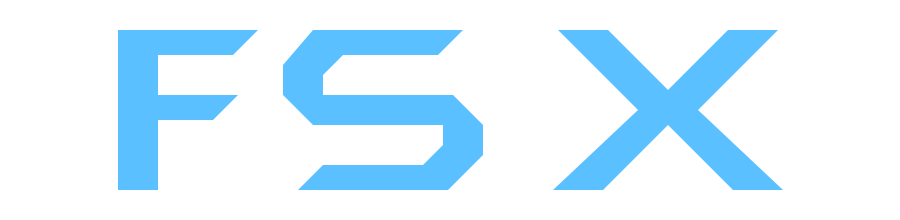

Introducing FSX music player

this is a music player that can directly find you music you want from spotify and play whatever music with great design of this app
and more developed by

**abduhamid** and **yocrrz** <333


---


<p align="center">
  
</p>

<h2 align="center">Showcase</h2>

<table>
  <tr>
    <td>
      
    </td>
    <td>
      
    </td>
  </tr>
</table>

---

 <table>
  <tr>
    <td align="center">
      <strong>Android Player</strong><br><br>
      
    </td>
    <td align="center">
      <strong>Desktop Player</strong><br><br>
      
    </td>
  </tr>
</table>


---


## Features

- Spotify downloader (OMG)
- Freaking cool UI
- Server like thing host your own
- Upload ur own songs
- Metadata awesome extractions
- Web
- Python/flask (llightweight
- Album arts
- Smooth and responsive

## How to download??
- Step 1
```bash
git clone https://github.com/YOCRRZ224/FSX.git && cd FSX
```
- Step 2
```bash
pip install -r requirements.txt
```
- step 3
```bash
python main.py
```
- Step 4
- copy and paste in web use your local address or wlan address given
```bash
http://127.0.0.1/5000
```

- Step 5 (optional)
- there's a folder called assets it containes videos and images which doesn't relates to your need so delete it if you want.

```bash
rm -rf assets
```
---

this was the last step you could run main.py and go on web.

---
### Tech stack
<p align="center">
  
  
  
  
  
</p>

---

### Stats


---

there's a NCS song in the music folder for test so here's the attribution also thanks NCS 

```bash
Song: Aizu, SFRNG, SOVAGI - IN MY HEAD
Music provided by NoCopyrightSounds
Free Download/Stream: https://ncs.io/S_inmyhead
Watch: http://ncs.lnk.to/S_inmyheadAT/youtube
```
